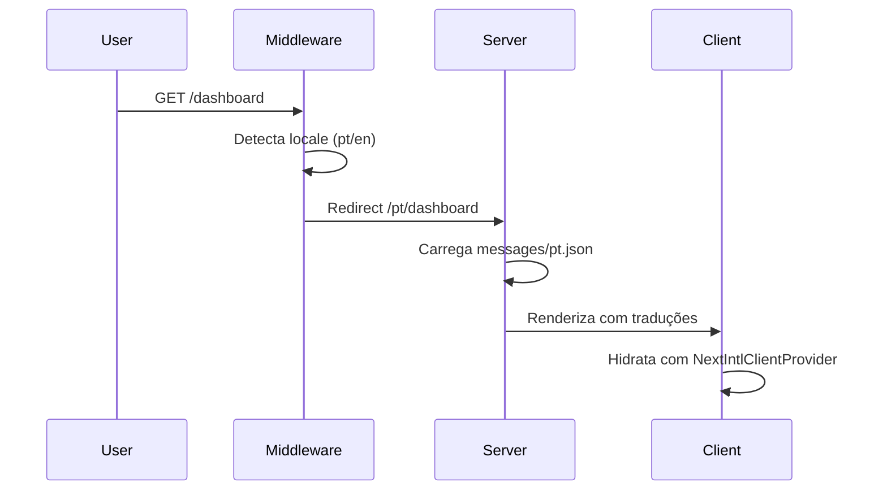

# Internationalization (i18n)

> Sistema robusto de internacionalização usando `next-intl` com suporte a pt-BR e EN, traduções type-safe e roteamento automático

## Visão Geral

O Kaven Boilerplate implementa internacionalização completa usando `next-intl`, uma biblioteca moderna para Next.js App Router que oferece:

- ✅ **Roteamento localizado** automático (`/pt/dashboard`, `/en/dashboard`)
- ✅ **Server-side rendering** com mensagens carregadas no servidor
- ✅ **Type-safe translations** com autocomplete no IDE
- ✅ **Detecção automática** de idioma preferido do usuário
- ✅ **Suporte a interpolação** de variáveis dinâmicas
- ✅ **Namespace organization** para organizar traduções por feature

**Idiomas Suportados:**

- 🇧🇷 **Português (pt-BR)** - Idioma padrão
- 🇺🇸 **English (EN)** - Idioma secundário

---

## Arquitetura

### Estrutura de Arquivos

```
apps/admin/
├── i18n/
│   ├── request.ts          # Configuração de mensagens (server-side)
│   └── routing.ts           # Configuração de rotas e navegação
├── messages/
│   ├── pt.json             # Traduções em Português
│   └── en.json             # Traduções em Inglês
├── middleware.ts            # Middleware de detecção de locale
└── app/
    └── [locale]/           # Rotas localizadas
        ├── layout.tsx      # Provider de i18n
        └── (dashboard)/    # Páginas do dashboard
```

### Fluxo de Funcionamento



---

## Componentes Principais

### 1. Middleware (`middleware.ts`)

O middleware é o ponto de entrada para localização. Ele intercepta **todas** as requisições e:

1. Detecta o idioma preferido do usuário (via header `Accept-Language` ou cookie)
2. Redireciona rotas sem locale para a versão localizada
3. Preserva o locale em todas as navegações subsequentes

**Configuração Crítica:**

```typescript
export const config = {
  // Match all pathnames EXCEPT:
  // - /api/* (APIs não precisam de locale)
  // - /_next/* (arquivos internos do Next.js)
  // - /_vercel/* (arquivos do Vercel)
  // - files with extensions (favicon.ico, images, etc)
  matcher: ['/((?!api|_next|_vercel|.*\\..*).*)'],
};
```

> [!WARNING]
> **Nunca remova o matcher!** Sem ele, o middleware tentará processar APIs e arquivos estáticos, causando "blank screen" e erros de hidratação.

**Implementação:**

```typescript
import createMiddleware from 'next-intl/middleware';
import { routing } from './i18n/routing';

export default createMiddleware(routing);

export const config = {
  matcher: ['/((?!api|_next|_vercel|.*\\..*).*)'],
};
```

---

### 2. Request Configuration (`i18n/request.ts`)

Configura como as mensagens são carregadas no servidor.

```typescript
import { getRequestConfig } from 'next-intl/server';
import { routing } from './routing';

export default getRequestConfig(async ({ requestLocale }) => {
  let locale = await requestLocale;

  // Fallback para locale padrão se inválido
  if (!locale || !routing.locales.includes(locale as 'pt' | 'en')) {
    locale = routing.defaultLocale;
  }

  return {
    locale,
    messages: (await import(`../messages/${locale}.json`)).default,
  };
});
```

**Características:**

- ✅ Carregamento dinâmico de mensagens baseado no locale
- ✅ Fallback automático para `pt` se locale inválido
- ✅ Type-safe com TypeScript

---

### 3. Routing Configuration (`i18n/routing.ts`)

Define a configuração de roteamento e exporta wrappers de navegação locale-aware.

```typescript
import { defineRouting } from 'next-intl/routing';
import { createNavigation } from 'next-intl/navigation';

export const routing = defineRouting({
  locales: ['pt', 'en'],
  defaultLocale: 'pt',
  localePrefix: 'always', // Sempre incluir /pt ou /en na URL
});

// Exportar wrappers que automaticamente incluem o locale
export const { Link, redirect, usePathname, useRouter } =
  createNavigation(routing);
```

**Wrappers Exportados:**

| Wrapper       | Uso                          | Exemplo                                    |
| ------------- | ---------------------------- | ------------------------------------------ |
| `Link`        | Links internos               | `<Link href="/dashboard">Dashboard</Link>` |
| `useRouter`   | Navegação programática       | `router.push('/settings')`                 |
| `usePathname` | Obter pathname atual         | `const path = usePathname()`               |
| `redirect`    | Redirecionamento server-side | `redirect('/login')`                       |

> [!IMPORTANT]
> **SEMPRE use estes wrappers** ao invés de `next/link` ou `next/navigation` dentro de `app/[locale]`. Caso contrário, o locale será perdido na navegação.

---

### 4. Client Provider (`app/[locale]/layout.tsx`)

O `NextIntlClientProvider` hidrata os componentes client-side com as mensagens carregadas no servidor.

```typescript
import { NextIntlClientProvider } from 'next-intl';
import { getMessages } from 'next-intl/server';

export default async function LocaleLayout({
  children,
  params: { locale },
}: {
  children: React.ReactNode;
  params: { locale: string };
}) {
  const messages = await getMessages();

  return (
    <html lang={locale}>
      <body>
        <NextIntlClientProvider messages={messages}>
          {children}
        </NextIntlClientProvider>
      </body>
    </html>
  );
}
```

---

## Estrutura de Mensagens

### Organização por Namespace

As traduções são organizadas em **namespaces** para facilitar manutenção:

```json
{
  "Common": {
    "dashboard": "Dashboard",
    "actions": "Ações",
    "users": "Usuários"
  },
  "Dashboard": {
    "title": "Dashboard {name}",
    "cards": {
      "totalUsers": "Usuários Ativos"
    }
  },
  "Observability": {
    "title": "Observabilidade",
    "goldenSignals": {
      "latency": "Latency (p95)"
    }
  },
  "AuditLogs": {
    "title": "Logs de Auditoria",
    "table": {
      "columns": {
        "dateTime": "Data/Hora"
      }
    }
  }
}
```

**Convenções de Nomenclatura:**

- **PascalCase** para namespaces (`Dashboard`, `AuditLogs`)
- **camelCase** para chaves (`totalUsers`, `dateTime`)
- **Nested objects** para organização hierárquica
- **Interpolação** com `{variableName}`

---

## Guia de Uso

### Server Components

Use `getTranslations` para componentes server-side:

```typescript
import { getTranslations } from 'next-intl/server';

export default async function DashboardPage() {
  const t = await getTranslations('Dashboard');

  return (
    <div>
      <h1>{t('title', { name: 'Admin' })}</h1>
      <p>{t('cards.totalUsers')}</p>
    </div>
  );
}
```

**Características:**

- ✅ Async/await obrigatório
- ✅ Mensagens carregadas no servidor (melhor performance)
- ✅ SEO-friendly (conteúdo renderizado no HTML)

---

### Client Components

Use `useTranslations` hook para componentes client-side:

```typescript
'use client';
import { useTranslations } from 'next-intl';

export function WelcomeMessage() {
  const t = useTranslations('Common');

  return <div>{t('welcome')}</div>;
}
```

**Características:**

- ✅ Hook síncrono (sem await)
- ✅ Mensagens hidratadas do servidor
- ✅ Reativo a mudanças de locale

---

### Interpolação de Variáveis

Suporte a variáveis dinâmicas nas traduções:

**messages/pt.json:**

```json
{
  "Dashboard": {
    "greeting": "Olá, {name}!",
    "stats": "Você tem {count} {count, plural, one {usuário} other {usuários}}"
  }
}
```

**Uso:**

```typescript
const t = useTranslations('Dashboard');

// Simples
<h1>{t('greeting', { name: 'João' })}</h1>
// Output: "Olá, João!"

// Plural
<p>{t('stats', { count: 1 })}</p>
// Output: "Você tem 1 usuário"

<p>{t('stats', { count: 5 })}</p>
// Output: "Você tem 5 usuários"
```

---

### Navegação Localizada

**Links Internos:**

```typescript
import { Link } from '@/i18n/routing';

// ✅ CORRETO - Usa wrapper do i18n
<Link href="/dashboard">Dashboard</Link>
// Renderiza: /pt/dashboard ou /en/dashboard

// ❌ ERRADO - Perde o locale
import { Link } from 'next/link';
<Link href="/dashboard">Dashboard</Link>
// Renderiza: /dashboard (erro 404)
```

**Navegação Programática:**

```typescript
import { useRouter } from '@/i18n/routing';

function MyComponent() {
  const router = useRouter();

  const handleClick = () => {
    router.push('/settings'); // Automaticamente vira /pt/settings
  };

  return <button onClick={handleClick}>Ir para Settings</button>;
}
```

**Redirecionamento Server-Side:**

```typescript
import { redirect } from '@/i18n/routing';

export default async function Page() {
  const user = await getUser();

  if (!user) {
    redirect('/login'); // Automaticamente vira /pt/login
  }

  return <div>Welcome</div>;
}
```

---

## Adicionando Novo Idioma

### Passo 1: Criar Arquivo de Mensagens

```bash
# Criar novo arquivo de traduções
cp apps/admin/messages/pt.json apps/admin/messages/es.json
```

### Passo 2: Atualizar Configuração

**`i18n/routing.ts`:**

```typescript
export const routing = defineRouting({
  locales: ['pt', 'en', 'es'], // ← Adicionar 'es'
  defaultLocale: 'pt',
  localePrefix: 'always',
});
```

### Passo 3: Traduzir Mensagens

Edite `messages/es.json` e traduza todas as chaves:

```json
{
  "Common": {
    "dashboard": "Panel de Control",
    "actions": "Acciones",
    "users": "Usuarios"
  }
}
```

### Passo 4: Testar

```bash
# Acessar URL com novo locale
http://localhost:3000/es/dashboard
```

---

## Adicionando Nova Tradução

### Passo 1: Adicionar Chave nos Arquivos JSON

**`messages/pt.json`:**

```json
{
  "MyFeature": {
    "title": "Minha Feature",
    "description": "Descrição da feature"
  }
}
```

**`messages/en.json`:**

```json
{
  "MyFeature": {
    "title": "My Feature",
    "description": "Feature description"
  }
}
```

### Passo 2: Usar no Componente

```typescript
const t = useTranslations('MyFeature');

<h1>{t('title')}</h1>
<p>{t('description')}</p>
```

---

## Troubleshooting

### Erro: "Blank Screen" ou Tela Branca

**Causa:** Middleware processando rotas que não deveria (APIs, `_next`, etc)

**Solução:**

```typescript
// Verificar matcher no middleware.ts
export const config = {
  matcher: ['/((?!api|_next|_vercel|.*\\..*).*)'],
};
```

---

### Erro: "Missing message" no Console

**Causa:** Chave de tradução não existe no arquivo JSON

**Solução:**

1. Verificar se a chave existe em `messages/pt.json` e `messages/en.json`
2. Verificar se o namespace está correto
3. Reiniciar o dev server após adicionar novas chaves

---

### Erro: Locale Perdido na Navegação

**Causa:** Usando `next/link` ou `next/navigation` ao invés dos wrappers

**Solução:**

```typescript
// ❌ ERRADO
import { Link } from 'next/link';

// ✅ CORRETO
import { Link } from '@/i18n/routing';
```

---

### Erro: TypeScript não Reconhece Traduções

**Causa:** Cache do TypeScript desatualizado

**Solução:**

```bash
# Limpar cache e reiniciar
rm -rf .next
pnpm dev
```

---

## Melhores Práticas

### ✅ Fazer

- **Organize por namespace** - Agrupe traduções relacionadas
- **Use interpolação** - Para textos dinâmicos
- **Mantenha consistência** - Mesma estrutura em todos os idiomas
- **Teste ambos os idiomas** - Sempre valide pt e en
- **Use wrappers de navegação** - Sempre use `Link` e `useRouter` do i18n

### ❌ Não Fazer

- **Hardcode textos** - Nunca coloque textos direto no JSX
- **Misture idiomas** - Não misture pt e en no mesmo arquivo
- **Ignore namespaces** - Não coloque tudo em um único namespace
- **Use next/link direto** - Sempre use o wrapper do i18n
- **Esqueça de traduzir** - Sempre adicione em pt.json E en.json

---

## Relacionados

- [Design System - Typography](/design-system/foundation/typography)
- [Platform - Authentication](/platform/authentication)
- [Platform - Observability](/platform/guides/observability)
