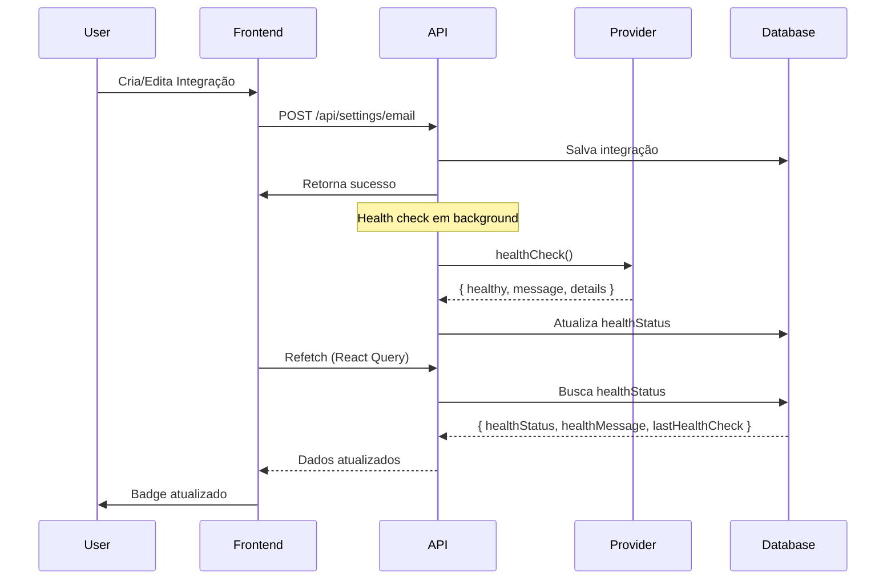
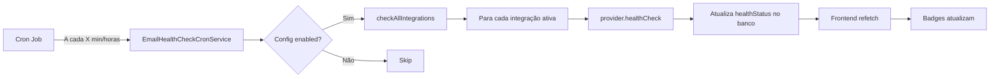
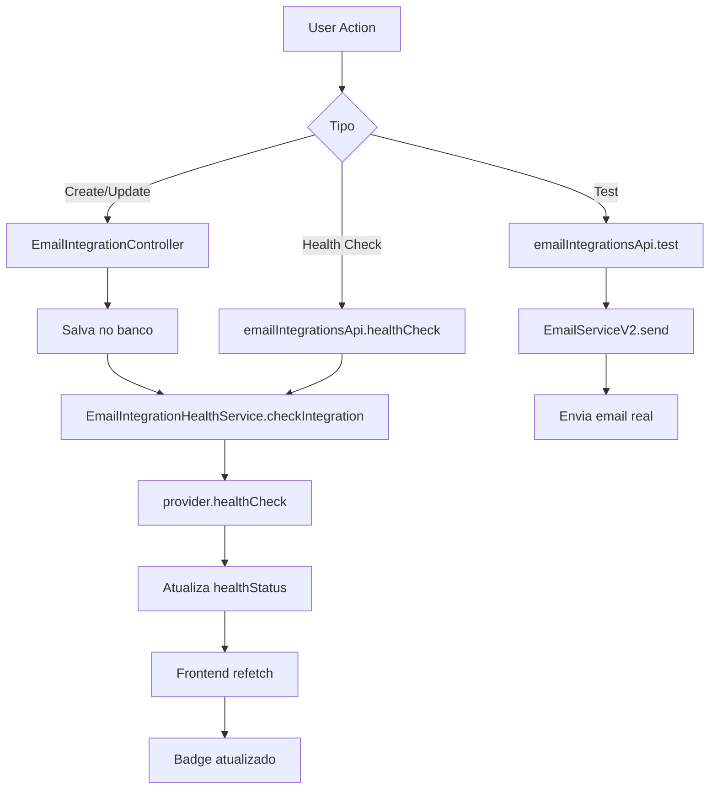

# Email Integration Health Check System

> Sistema completo de validação automática de credenciais e monitoramento de saúde para integrações de email com CRUD completo, health check automático, cron job configurável e integração com Observability.

## Visão Geral

O **Email Integration Health Check System** é uma solução end-to-end para gerenciar e monitorar integrações de email na plataforma Kaven. O sistema valida automaticamente credenciais, testa conectividade real com providers e exibe status em tempo real tanto no admin panel quanto no Observability.

### Principais Features

- ✅ **Health Check Automático** - Valida credenciais e conectividade após create/update
- ✅ **CRUD Completo** - Interface intuitiva para gerenciar integrações (SMTP, Resend, Postmark, AWS SES)
- ✅ **Badge de Status Visual** - Indicadores coloridos (🟢 Healthy, 🔴 Unhealthy, ⚪ Unconfigured)
- ✅ **Cron Job Configurável** - Health check automático em intervalos personalizáveis (15m, 30m, 1h, 6h, 12h, 24h)
- ✅ **Integração com Observability** - Status fidedigno em External APIs
- ✅ **Test Connectivity** - Validação manual de credenciais
- ✅ **Send Test Email** - Envio de email real para teste
- ✅ **Traduções Bilíngues** - Suporte completo PT/EN

### Providers Suportados

| Provider     | Health Check Method             | Features                    |
| ------------ | ------------------------------- | --------------------------- |
| **SMTP**     | `nodemailer.verify()`           | Conexão direta, TLS/SSL     |
| **Resend**   | Validação de formato da API key | Funciona com keys restritas |
| **Postmark** | `getServer()` API call          | Valida server token         |
| **AWS SES**  | Validação de credenciais AWS    | Suporta múltiplas regiões   |

---

## Como Funciona

### Fluxo de Health Check



### Cron Job Automático



---

## Exemplos de Uso

### 1. Criar Integração SMTP

```typescript
import { emailIntegrationsApi } from '@/lib/api/email-integrations';

const integration = await emailIntegrationsApi.create({
  provider: 'SMTP',
  fromName: 'Kaven',
  fromEmail: 'no-reply@kaven.site',
  smtpHost: 'smtp.gmail.com',
  smtpPort: 587,
  smtpSecure: true,
  smtpUser: 'your-email@gmail.com',
  smtpPassword: 'your-app-password',
  isActive: true,
  isPrimary: true,
});

// Health check executa automaticamente em background
// healthStatus será atualizado em ~2-5 segundos
```

### 2. Criar Integração Resend

```typescript
const integration = await emailIntegrationsApi.create({
  provider: 'RESEND',
  fromName: 'Kaven',
  fromEmail: 'no-reply@kaven.site',
  apiKey: 're_your_api_key_here',
  transactionalDomain: 'auth.kaven.site',
  marketingDomain: 'mail.kaven.site',
  isActive: true,
  isPrimary: false,
});

// Health check valida formato da API key (re_*)
// Funciona mesmo com API keys restritas a apenas enviar emails
```

### 3. Testar Conectividade Manualmente

```typescript
// No frontend (React)
import { useTestConnection } from '@/hooks/useTestConnection';

function IntegrationCard({ integration }) {
  const { testConnection, isLoading } = useTestConnection();

  const handleTest = async () => {
    const result = await testConnection(integration.id);

    if (result.healthy) {
      toast.success('✅ Conexão bem-sucedida!');
    } else {
      toast.error(`❌ ${result.message}`);
    }
  };

  return (
    <button onClick={handleTest} disabled={isLoading}>
      {isLoading ? 'Testando...' : 'Test Connectivity'}
    </button>
  );
}
```

### 4. Enviar Email de Teste

```typescript
import { useTestEmail } from '@/hooks/useTestEmail';

function IntegrationCard({ integration }) {
  const { sendTestEmail, isLoading } = useTestEmail();

  const handleSendTest = async () => {
    const result = await sendTestEmail(integration.id, 'sandbox');

    if (result.success) {
      toast.success('📧 Email de teste enviado!');
    } else {
      toast.error(`❌ ${result.error}`);
    }
  };

  return (
    <button onClick={handleSendTest} disabled={isLoading}>
      {isLoading ? 'Enviando...' : 'Send Test Email'}
    </button>
  );
}
```

### 5. Configurar Cron Job

```typescript
import { healthCheckConfigApi } from '@/lib/api/health-check-config';

// Habilitar health check automático a cada hora
await healthCheckConfigApi.updateConfig({
  enabled: true,
  frequency: '1h',
});

// Executar health check manualmente
await healthCheckConfigApi.runNow();
```

---

## API Reference

### Backend API

#### `POST /api/settings/email`

Cria uma nova integração de email.

**Body:**

```typescript
{
  provider: 'SMTP' | 'RESEND' | 'POSTMARK' | 'AWS_SES';
  fromName: string;
  fromEmail: string;
  isActive: boolean;
  isPrimary: boolean;

  // SMTP specific
  smtpHost?: string;
  smtpPort?: number;
  smtpSecure?: boolean;
  smtpUser?: string;
  smtpPassword?: string;

  // Resend/Postmark specific
  apiKey?: string;

  // AWS SES specific
  apiSecret?: string;
  region?: string;

  // Advanced
  transactionalDomain?: string;
  marketingDomain?: string;
  trackOpens?: boolean;
  trackClicks?: boolean;
  dailyLimit?: number;
  hourlyLimit?: number;
}
```

**Response:**

```typescript
{
  id: string;
  provider: string;
  fromName: string;
  fromEmail: string;
  isActive: boolean;
  isPrimary: boolean;
  healthStatus: 'healthy' | 'unhealthy' | 'unconfigured' | null;
  healthMessage: string | null;
  lastHealthCheck: Date | null;
  createdAt: Date;
  updatedAt: Date;
}
```

**Comportamento:**

- Health check executa automaticamente em background
- Não bloqueia resposta ao usuário
- `healthStatus` será atualizado em ~2-5 segundos

---

#### `PUT /api/settings/email/:id`

Atualiza uma integração existente.

**Parâmetros:**

- `id` (string) - ID da integração

**Body:** Mesmo schema do POST (campos opcionais)

**Comportamento:**

- Health check executa automaticamente em background
- Se `isPrimary: true`, outras integrações são desmarcadas
- Credenciais sensíveis são criptografadas antes de salvar

---

#### `GET /api/settings/email/:id/health`

Executa health check manualmente e retorna resultado.

**Parâmetros:**

- `id` (string) - ID da integração

**Response:**

```typescript
{
  healthy: boolean;
  message: string;
  details?: {
    // Provider-specific details
    domains?: number;
    verified_domains?: number;
    server_name?: string;
  };
}
```

---

#### `POST /api/settings/email/test`

Envia email de teste real.

**Body:**

```typescript
{
  id: string;
  mode?: 'sandbox' | 'custom'; // Default: 'custom'
}
```

**Response:**

```typescript
{
  success: boolean;
  message?: string;
  messageId?: string;
  error?: string;
  isInfo?: boolean; // True se é mensagem informativa, não erro
}
```

**Modos:**

- `sandbox` - Usa domínio de teste do provider (onboarding@resend.dev, etc)
- `custom` - Usa domínio configurado na integração

---

#### `GET /api/settings/email/health-check-config`

Busca configuração do cron job.

**Response:**

```typescript
{
  id: string;
  enabled: boolean;
  frequency: '15m' | '30m' | '1h' | '6h' | '12h' | '24h';
  lastRun: Date | null;
  nextRun: Date | null;
  createdAt: Date;
  updatedAt: Date;
}
```

---

#### `PUT /api/settings/email/health-check-config`

Atualiza configuração do cron job.

**Body:**

```typescript
{
  enabled?: boolean;
  frequency?: '15m' | '30m' | '1h' | '6h' | '12h' | '24h';
}
```

**Comportamento:**

- Reinicia cron job automaticamente com nova configuração
- Atualiza `nextRun` baseado na nova frequência

---

#### `POST /api/settings/email/health-check-config/run-now`

Executa health check manualmente para todas as integrações.

**Response:**

```typescript
{
  success: boolean;
  message: string;
}
```

**Comportamento:**

- Executa em background (não bloqueia)
- Valida todas as integrações ativas
- Atualiza `healthStatus` de todas

---

### Frontend API Client

#### `emailIntegrationsApi.list()`

Lista todas as integrações.

```typescript
const integrations = await emailIntegrationsApi.list();
// Returns: EmailIntegration[]
```

---

#### `emailIntegrationsApi.create(data)`

Cria nova integração.

```typescript
const integration = await emailIntegrationsApi.create({
  provider: 'SMTP',
  fromEmail: 'no-reply@kaven.site',
  // ...
});
```

---

#### `emailIntegrationsApi.update(id, data)`

Atualiza integração.

```typescript
await emailIntegrationsApi.update('integration-id', {
  isActive: false,
});
```

---

#### `emailIntegrationsApi.delete(id)`

Deleta integração.

```typescript
await emailIntegrationsApi.delete('integration-id');
```

---

#### `emailIntegrationsApi.test(id, mode?)`

Envia email de teste.

```typescript
const result = await emailIntegrationsApi.test('integration-id', 'sandbox');

if (result.success) {
  console.log('Email enviado!', result.messageId);
}
```

---

#### `healthCheckConfigApi.getConfig()`

Busca configuração do cron job.

```typescript
const config = await healthCheckConfigApi.getConfig();
console.log(config.enabled, config.frequency);
```

---

#### `healthCheckConfigApi.updateConfig(updates)`

Atualiza configuração do cron job.

```typescript
await healthCheckConfigApi.updateConfig({
  enabled: true,
  frequency: '1h',
});
```

---

#### `healthCheckConfigApi.runNow()`

Executa health check manualmente.

```typescript
await healthCheckConfigApi.runNow();
toast.success('Health check executado!');
```

---

## Configuração

### Variáveis de Ambiente

```env
# Encryption (obrigatório)
ENCRYPTION_KEY=your-32-char-encryption-key-here

# SMTP (opcional - apenas se usar SMTP)
SMTP_HOST=smtp.gmail.com
SMTP_PORT=587
SMTP_SECURE=true
SMTP_USER=your-email@gmail.com
SMTP_PASSWORD=your-app-password

# Resend (opcional - apenas se usar Resend)
RESEND_API_KEY=re_your_api_key_here

# Postmark (opcional - apenas se usar Postmark)
POSTMARK_SERVER_TOKEN=your-server-token-here

# AWS SES (opcional - apenas se usar AWS SES)
AWS_ACCESS_KEY_ID=your-access-key
AWS_SECRET_ACCESS_KEY=your-secret-key
AWS_REGION=us-east-1
```

### Setup Inicial

```bash
# 1. Aplicar migrations
cd packages/database
pnpm prisma migrate deploy

# 2. Regenerar Prisma Client
pnpm prisma generate

# 3. Reiniciar API
cd apps/api
pnpm dev

# 4. Acessar admin panel
http://localhost:3000/saas-settings/integrations
```

---

## Troubleshooting

### Erro: "API key validation failed: 401"

**Problema:** API key do Resend está restrita a apenas enviar emails.

**Solução:**
O sistema agora valida apenas o formato da API key (deve começar com `re_`) ao invés de chamar `/domains`. Isso funciona com API keys restritas.

```typescript
// Health check do Resend
if (!this.config.apiKey.startsWith('re_')) {
  return { healthy: false, message: 'Invalid API key format' };
}

return { healthy: true, message: 'Resend API key format is valid' };
```

---

### Erro: "Provider not initialized"

**Problema:** Integração foi criada mas provider não foi inicializado no `EmailServiceV2`.

**Solução:**
O sistema recarrega providers automaticamente após create/update. Se o erro persistir:

```typescript
// Forçar reload manual
await EmailServiceV2.getInstance().reload();
```

---

### Erro: "SMTP connection timeout"

**Problema:** Firewall bloqueando porta 587/465 ou credenciais inválidas.

**Solução:**

1. Verificar firewall:

```bash
telnet smtp.gmail.com 587
```

2. Verificar credenciais:

- Gmail: Use "App Password", não senha normal
- Outlook: Habilite "SMTP Auth" nas configurações

3. Testar com `nodemailer` diretamente:

```typescript
const transporter = nodemailer.createTransport({
  host: 'smtp.gmail.com',
  port: 587,
  secure: false,
  auth: {
    user: 'your-email@gmail.com',
    pass: 'your-app-password',
  },
});

await transporter.verify();
```

---

### Health Check não atualiza automaticamente

**Problema:** Health check executa mas `healthStatus` não aparece no frontend.

**Solução:**

1. Verificar se React Query está fazendo refetch:

```typescript
const { data, refetch } = useQuery({
  queryKey: ['email-integrations'],
  queryFn: emailIntegrationsApi.list,
  refetchInterval: 5000, // Refetch a cada 5s
});
```

2. Verificar logs do backend:

```bash
# Deve aparecer:
[HealthCheck] Checking integration: integration-id
[HealthCheck] Result: healthy
[HealthCheck] Updated healthStatus in database
```

3. Verificar banco de dados:

```sql
SELECT id, provider, health_status, health_message, last_health_check
FROM email_integrations
WHERE id = 'integration-id';
```

---

## Arquitetura

### Estrutura de Arquivos

```
apps/api/src/
├── lib/email/
│   ├── providers/
│   │   ├── resend.provider.ts      # Health check por formato
│   │   ├── smtp.provider.ts        # Health check por conexão
│   │   ├── postmark.provider.ts    # Health check por API
│   │   └── aws-ses.provider.ts     # Health check por credenciais
│   └── types.ts                    # Interface IEmailProvider
│
├── modules/platform/
│   ├── controllers/
│   │   ├── email-integration.controller.ts
│   │   └── email-health-check-config.controller.ts
│   ├── services/
│   │   └── email-integration-health.service.ts
│   └── routes/
│       └── email-integration.routes.ts
│
├── modules/observability/
│   └── services/
│       └── external-api-monitor.service.ts  # Integração com Observability
│
└── jobs/
    └── email-health-check-cron.service.ts   # Cron job automático

apps/admin/
├── sections/email-integrations/
│   ├── email-integrations-list.tsx
│   ├── email-integration-card.tsx
│   ├── email-integration-dialog.tsx
│   ├── provider-fields.tsx
│   └── health-check-config.tsx              # UI do cron job
│
└── lib/api/
    ├── email-integrations.ts
    └── health-check-config.ts
```

### Fluxo de Dados



---

## Relacionados

- [Email Service V2](/platform/email-service-v2)
- [Observability System](/platform/observability)
- [Cron Jobs](/platform/cron-jobs)
- [Platform Settings](/platform/settings)
