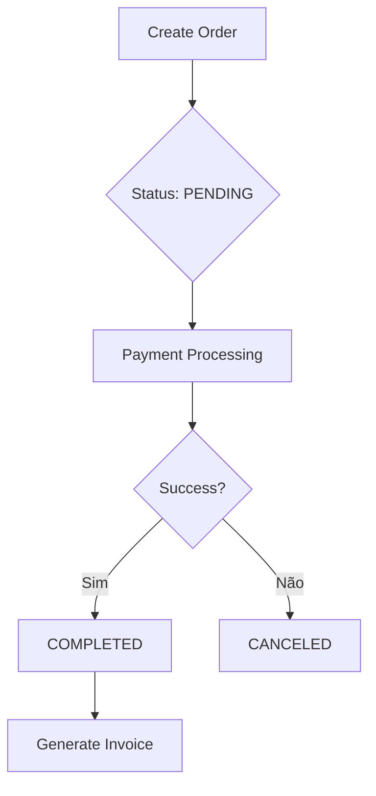

# Orders

O módulo de **Orders** é responsável por gerenciar o ciclo de vida de pedidos dentro de cada Tenant. Ele serve como o agregador central para transações, vinculando produtos, pagamentos e usuários.

## Visão Geral

Cada pedido possui um `orderNumber` único gerado no formato `ORD-YYYYMMDD-XXXX` e é estritamente isolado por `tenantId`.

### Estados do Pedido

| Status       | Descrição                                              |
| :----------- | :----------------------------------------------------- |
| `PENDING`    | Pedido criado, aguardando confirmação de pagamento.    |
| `PROCESSING` | Pagamento confirmado, pedido em processamento interno. |
| `COMPLETED`  | Ciclo finalizado com sucesso.                          |
| `CANCELED`   | Pedido cancelado pelo usuário ou sistema.              |
| `REFUNDED`   | Valor total ou parcial devolvido ao cliente.           |

## Arquitetura

O `OrderService` gerencia as operações de CRUD e transições de estado:



## Exemplo de Uso

### Criando um Pedido

O pedido deve sempre conter o `tenantId` para garantir o isolamento Multi-tenant.

```typescript
const order = await orderService.createOrder({
  tenantId: "tenant-uuid",
  totalAmount: 150.0,
  currency: "BRL",
  metadata: { source: "web-store" },
});
```

### Listando Pedidos

A listagem suporta paginação e filtro automático por `tenantId`.

```typescript
const { orders, pagination } = await orderService.listOrders(tenantId, 1, 10);
```

## Segurança & Invariantes

1. **Isolation:** Nenhuma query de order pode ser executada sem um filtro de `tenantId` (validado via middleware).
2. **Soft Delete:** Pedidos não são removidos fisicamente do banco de dados; o campo `deletedAt` é ativado para fins de auditoria.
3. **Imutabilidade de Valor:** Uma vez criada, o `totalAmount` de uma order não deve ser alterado sem gerar um novo registro de auditoria.

## Relacionados

- [Payments](./payments)
- [Invoices](./invoices)
- [Tenants](./TENANT_MANAGEMENT)
