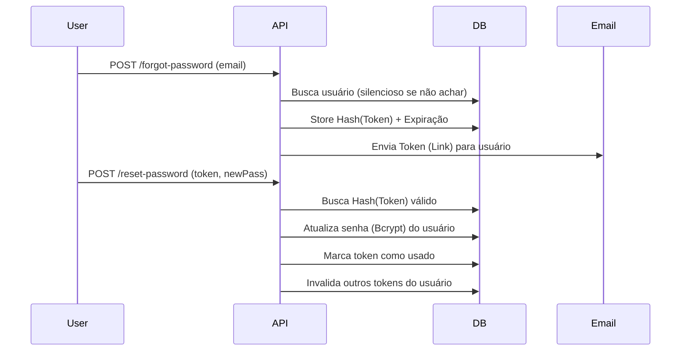

# Password Requests

> Uma implementação segura para recuperação de senhas baseada em tokens de curta duração.

## Visão Geral

Este módulo gerencia o processo de redefinição de senha quando um usuário perde o acesso à sua conta. Prioriza a segurança prevenindo enumeração de usuários e garantindo que links antigos sejam invalidados.

**Destaques de Segurança:**

- 🛡️ Tokens hash (SHA-256) armazenados no banco (nunca em texto plano)
- ⏱️ Expiração curta (1 hora)
- 🚫 Prevenção de enumeração (mensagens genéricas de sucesso)
- 🧹 Invalidação automática de tokens anteriores ao usar um novo

## Fluxo Técnico



## API Reference

### `requestReset(email)`

Inicia o processo de recuperação.

**Comportamento:**

- Se o usuário não existir, retorna sucesso falso para evitar enumeração.
- Se existir, gera token, salva hash e envia email.

**Exemplo:**

```typescript
// Retorna sempre mensagem de sucesso genérica
const result = await passwordResetService.requestReset('user@example.com');
```

### `resetPassword(token, newPassword)`

Consome o token e atualiza a credencial.

**Lógica:**

1. Recria o hash SHA-256 do token recebido.
2. Busca no banco por token não usado e não expirado.
3. Hash da nova senha com Bcrypt (custo 10).
4. Invalida **todos** os tokens pendentes deste usuário para segurança extra.

**Exemplo:**

```typescript
await passwordResetService.resetPassword(
  'raw_token_string_from_email',
  'NewSecurePassword123!',
);
```

## Security Best Practices

1. **Token Hashing:** O token enviado por email é salvo apenas como hash no banco. Se o banco vazar, os tokens não podem ser usados por atacantes.
2. **Generic Responses:** "If email exists, reset link sent" impede que atacantes descubram quais emails estão cadastrados.
3. **Token Rotation:** Ao resetar a senha, todos os outros tokens de reset pendentes são invalidados.
