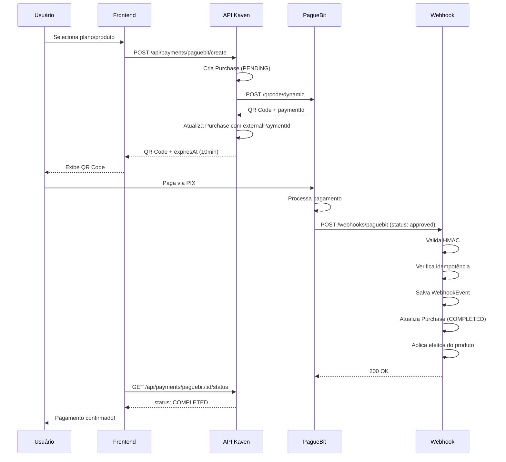

# PagueBit Integration - Documentação Técnica

**Data:** 05 de janeiro de 2026  
**Status:** ✅ IMPLEMENTADO  
**Versão:** 1.0.0

---

## 📋 Visão Geral

Integração completa com PagueBit para processamento de pagamentos PIX no sistema Kaven. Implementa QR Code Dinâmico, validação de webhooks com HMAC-SHA256 v2, retry automático em rate limit e integração com sistema de Plans & Products.

---

## 🏗️ Arquitetura

### Estrutura de Arquivos

```
apps/api/src/
├── lib/
│   └── validation-payments.ts          # Schemas Zod
├── modules/
│   └── payments/
│       ├── providers/
│       │   ├── pix.interface.ts        # Interface agnóstica
│       │   └── paguebit/
│       │       ├── paguebit.client.ts  # HTTP client com retry
│       │       ├── paguebit.service.ts # Service principal
│       │       ├── paguebit.types.ts   # DTOs e interfaces
│       │       └── paguebit.webhook.ts # Webhook handler
│       ├── controllers/
│       │   └── payment.controller.ts   # Controller (atualizado)
│       └── routes/
│           └── payment.routes.ts       # Routes (atualizado)

prisma/
└── schema.prisma                       # WebhookEvent model
```

### Componentes Principais

#### 1. IPixProvider (Interface Agnóstica)

Interface que abstrai providers de pagamento PIX, permitindo trocar de provider sem alterar código.

```typescript
export interface IPixProvider {
  createDynamicQRCode(params: CreateQRCodeParams): Promise<QRCodeResponse>;
  getPaymentStatus(paymentId: string): Promise<PaymentStatus>;
  validateWebhook(signature: string, body: string, timestamp: string): boolean;
  processWebhook(payload: WebhookPayload): Promise<void>;
}
```

#### 2. PagueBitClient (HTTP Client)

Cliente HTTP com retry automático em rate limit (429).

**Características:**

- Retry com backoff exponencial (2s, 4s, 8s)
- Rate limit: 300 req/min por IP
- Timeout: 30 segundos
- Base URL: `https://api.paguebit.com/v1`

**Exemplo:**

```typescript
const client = new PagueBitClient();
const response = await client.post('/qrcode/dynamic', data, (retries = 3));
```

#### 3. PagueBitService

Service principal que implementa `IPixProvider`.

**Métodos:**

- `createDynamicQRCode()` - Criar QR Code com expiração de 10 minutos
- `getPaymentStatus()` - Buscar status de pagamento
- `validateWebhook()` - Validar assinatura HMAC-SHA256 v2

**Validação HMAC v2:**

```typescript
// Versão 2: HMAC-SHA256(timestamp + body, secret)
const payload = timestamp + body;
const expectedSignature = crypto
  .createHmac('sha256', secret)
  .update(payload)
  .digest('hex');
```

#### 4. PagueBitWebhook (Handler)

Handler de webhooks com idempotência e processamento de status.

**Fluxo:**

1. Validar assinatura HMAC
2. Verificar idempotência (WebhookEvent)
3. Salvar evento no banco
4. Processar payload
5. Marcar como processado

**Status de Pagamento:**

- `pending` - Aguardando pagamento (não fazer nada)
- `review` - Em análise (NÃO confirmar ainda)
- `approved` - ✅ ÚNICO que confirma recebimento
- `not_approved` - Rejeitado/expirado/estornado

---

## 🔌 API Endpoints

### POST /api/payments/paguebit/create

Criar pagamento PIX (produto ou plano).

**Request:**

```json
{
  "userId": "uuid",
  "tenantId": "uuid",
  "productId": "uuid", // OU planId
  "planId": "uuid" // OU productId
}
```

**Response:**

```json
{
  "purchaseId": "uuid",
  "paymentId": "paguebit-payment-id",
  "qrCode": "base64-image",
  "qrCodeText": "00020126...codigo-pix",
  "expiresAt": "2026-01-05T12:46:00Z",
  "amount": 29.99
}
```

### GET /api/payments/paguebit/:id/status

Verificar status de pagamento.

**Response:**

```json
{
  "id": "purchase-uuid",
  "status": "PENDING|COMPLETED|FAILED",
  "amount": 29.99,
  "externalPaymentId": "paguebit-payment-id"
}
```

### POST /api/webhooks/paguebit

Webhook do PagueBit (chamado automaticamente).

**Headers:**

```
X-Paguebit-Signature: hmac-sha256-hex
X-Paguebit-Timestamp: unix-timestamp
X-Paguebit-Event-Id: unique-event-id
```

**Payload:**

```json
{
  "id": "payment-id",
  "external_id": "purchase-uuid",
  "value": 29.99,
  "status": "approved",
  "paid_at": "2026-01-05T12:45:00Z"
}
```

---

## 🗄️ Database Schema

### WebhookEvent Model

```prisma
model WebhookEvent {
  id String @id @default(uuid())

  /// ID externo do evento (para idempotência)
  externalId String @unique @map("external_id")

  /// Provider (PAGUEBIT, STRIPE, etc)
  provider String

  /// Tipo de evento
  event String

  /// Payload completo
  payload Json

  /// Quando foi processado
  processedAt DateTime? @map("processed_at")

  createdAt DateTime @default(now()) @map("created_at")

  @@index([provider])
  @@index([event])
  @@map("webhook_events")
}
```

---

## ⚙️ Configuração

### Variáveis de Ambiente

```bash
# .env
PAGUEBIT_API_TOKEN=seu-token-aqui
PAGUEBIT_WEBHOOK_SECRET=seu-secret-aqui
```

### Obter Credenciais

1. Acesse [PagueBit Dashboard](https://dashboard.paguebit.com)
2. Vá em **Configurações** → **API**
3. Copie o **API Token**
4. Copie o **Webhook Secret**

---

## 🔒 Segurança

### Validação de Webhook

**SEMPRE** validar assinatura HMAC antes de processar:

```typescript
const isValid = pagueBitService.validateWebhook(signature, body, timestamp);
if (!isValid) {
  return reply.status(401).send({ error: 'Invalid signature' });
}
```

### Idempotência

Webhooks podem ser enviados múltiplas vezes. Use `X-Paguebit-Event-Id` para evitar processamento duplicado:

```typescript
const existingEvent = await prisma.webhookEvent.findUnique({
  where: { externalId: eventId },
});

if (existingEvent) {
  return reply.status(200).send({ received: true, duplicate: true });
}
```

---

## 📊 Fluxo de Pagamento



---

## 🧪 Testes

### Teste Manual (Desenvolvimento)

```bash
# 1. Criar pagamento
curl -X POST http://localhost:8000/api/payments/paguebit/create \
  -H "Content-Type: application/json" \
  -d '{
    "userId": "user-uuid",
    "tenantId": "tenant-uuid",
    "planId": "plan-uuid"
  }'

# 2. Verificar status
curl http://localhost:8000/api/payments/paguebit/{purchaseId}/status

# 3. Simular webhook (use ngrok para expor localhost)
curl -X POST https://your-domain.com/api/webhooks/paguebit \
  -H "X-Paguebit-Signature: hmac-signature" \
  -H "X-Paguebit-Timestamp: 1704470400" \
  -H "X-Paguebit-Event-Id: unique-id" \
  -d '{
    "id": "payment-id",
    "external_id": "purchase-uuid",
    "value": 29.99,
    "status": "approved"
  }'
```

---

## ⚠️ Tratamento de Erros

### Rate Limit (429)

Retry automático com backoff exponencial:

- 1ª tentativa: imediata
- 2ª tentativa: 2 segundos
- 3ª tentativa: 4 segundos
- 4ª tentativa: 8 segundos

### QR Code Expirado

- **Expiração:** 10 minutos
- **Status final:** `not_approved`
- **Pagamento após expiração:** Estornado automaticamente

### Webhook Duplicado

Idempotência garante que mesmo evento não seja processado 2x.

---

## 📈 Monitoramento

### Logs Importantes

```typescript
// Webhook recebido
console.log(
  `📥 Processando webhook: ${payload.id} | Status: ${payload.status}`,
);

// Pagamento aprovado
console.log(`✅ Pagamento ${externalId} aprovado!`);

// Webhook duplicado
console.log(`✅ Webhook ${eventId} já processado anteriormente`);

// Erro de validação
console.error('❌ Webhook signature inválida');
```

### Métricas Recomendadas

- Taxa de sucesso de webhooks
- Tempo médio de processamento
- Taxa de retry em rate limit
- QR Codes expirados vs pagos

---

## 🔄 Próximos Passos

### Pendências (Aguardando Resposta PagueBit)

1. **Loja Virtual API**
   - CRUD de produtos via API
   - Sincronização automática

2. **QR Code Estático**
   - Endpoint para buscar via API
   - Webhook para pagamentos

### Melhorias Futuras

- [ ] Implementar aplicação de efeitos de produtos
- [ ] Adicionar testes unitários
- [ ] Adicionar testes de integração
- [ ] Implementar dashboard de pagamentos
- [ ] Adicionar relatórios de transações

---

## 📚 Referências

- [PagueBit API Docs](https://docs.paguebit.com)
- [Respostas Técnicas Confirmadas](./PAGUEBIT_RESPONSES.md)
- [Plans & Products System](./PLANS_PRODUCTS.md)

---

**Última Atualização:** 05/01/2026 12:40  
**Autor:** Antigravity AI  
**Versão:** 1.0.0
