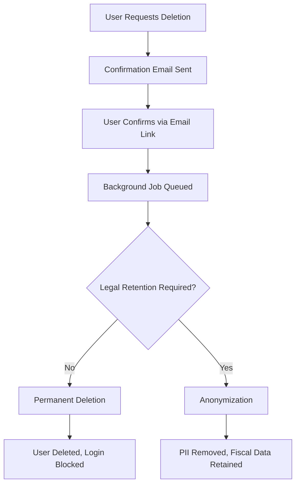

# GDPR Compliance Guide

> **Last Updated:** 2026-02-07
> **Compliance Framework:** GDPR (EU) + LGPD (Brazil)
> **Status:** ✅ Implementation Complete

---

## 📋 Table of Contents

- [Overview](#overview)
- [Right to Access](#right-to-access)
- [Right to Erasure](#right-to-erasure)
- [Consent Management](#consent-management)
- [Data Portability](#data-portability)
- [Data Retention](#data-retention)
- [Implementation Guide](#implementation-guide)
- [Testing](#testing)
- [Legal Disclaimers](#legal-disclaimers)

---

## Overview

The Kaven Framework implements comprehensive GDPR compliance features to ensure data privacy and user rights are respected across all tenant applications.

### Core Principles

1. **Data Minimization** - Collect only necessary data
2. **Purpose Limitation** - Use data only for stated purposes
3. **Storage Limitation** - Retain data only as long as necessary
4. **Accuracy** - Keep data accurate and up-to-date
5. **Integrity & Confidentiality** - Secure data against unauthorized access

---

## Right to Access

**GDPR Article 15** - Users have the right to obtain a copy of all their personal data.

### Implementation

```typescript
// Export user data in JSON format
GET /api/users/:id/export?format=json

// Export in CSV format
GET /api/users/:id/export?format=csv

// Export in XML format
GET /api/users/:id/export?format=xml
```

### Exported Data Includes

- **Personal Information:** email, name, phone, address
- **Financial Data:** invoices, payments, subscriptions
- **Project Data:** projects, tasks, spaces
- **Audit Logs:** login history, security events
- **Consent Records:** marketing preferences, data sharing consents

### Response Format (JSON)

```json
{
  "user_id": "usr_123",
  "email": "user@example.com",
  "profile": {
    "name": "John Doe",
    "phone": "+1234567890",
    "created_at": "2025-01-01T00:00:00Z"
  },
  "invoices": [...],
  "payments": [...],
  "subscriptions": [...],
  "projects": [...],
  "tasks": [...],
  "audit_logs": [...],
  "consents": [...],
  "export_metadata": {
    "export_date": "2026-02-07T10:30:00Z",
    "data_version": "1.0",
    "format": "json"
  }
}
```

### Performance

- Exports complete in **< 30 seconds** for typical users
- Large datasets (>10k records) trigger async export with email notification

---

## Right to Erasure

**GDPR Article 17** - Users have the right to have their personal data deleted ("right to be forgotten").

### Implementation

```typescript
// Request account deletion
DELETE /api/users/:id/gdpr-erase

// Response (async job queued)
{
  "message": "Erasure request accepted",
  "job_id": "gdpr-erase-usr_123",
  "estimated_completion": "2026-02-07T11:00:00Z"
}
```

### Deletion Process



### Cascade Deletion

When a user is deleted, the following data is also removed:

- ✅ **User profile** - Permanently deleted
- ✅ **Invoices** - Anonymized (fiscal retention)
- ✅ **Payments** - Anonymized (fiscal retention)
- ✅ **Subscriptions** - Canceled and deleted
- ✅ **Projects** - Deleted (unless shared with team)
- ✅ **Tasks** - Deleted
- ✅ **Audit Logs** - Deleted
- ✅ **Consent Records** - Deleted

### Legal Retention (Brazil & EU)

Certain data **must be retained** for legal/fiscal purposes:

| Data Type | Retention Period | Jurisdiction |
|-----------|-----------------|--------------|
| Fiscal Invoices (NF-e) | 7 years | Brazil (Law 8.137/1990) |
| Tax Documents | 7 years | Brazil |
| Audit Logs (Financial) | 5 years | EU GDPR Art. 17(3)(e) |

**Solution:** Anonymize user PII while retaining fiscal documents.

```sql
-- Anonymization (not deletion)
UPDATE users SET
  email = 'anonymized@example.com',
  name = 'ANONYMIZED',
  phone = NULL,
  address = NULL
WHERE id = 'usr_123';
```

---

## Consent Management

**GDPR Article 7** - Consent must be freely given, specific, informed, and unambiguous.

### Consent Types

| Type | Description | Default |
|------|-------------|---------|
| `marketing_emails` | Promotional emails, newsletters | Opt-out |
| `analytics_tracking` | Anonymous usage analytics (Google Analytics, etc.) | Opt-out |
| `third_party_sharing` | Share data with third-party partners | Opt-out |

### Implementation

```typescript
// Grant consent
POST /api/users/:id/consent
{
  "type": "marketing_emails",
  "granted": true,
  "policy_version": "2.1.0"
}

// Revoke consent
PUT /api/users/:id/consent/marketing_emails
{
  "granted": false
}

// View consent history
GET /api/users/:id/consent
```

### Audit Trail

Every consent change is logged with:
- **Timestamp** - When consent was granted/revoked
- **IP Address** - Where the request originated
- **Policy Version** - Which privacy policy version user agreed to
- **User Agent** - Browser/device information

---

## Data Portability

**GDPR Article 20** - Users have the right to receive their data in a structured, commonly used, machine-readable format.

### Supported Formats

- ✅ **JSON** - Structured data, easy to parse
- ✅ **CSV** - Compatible with Excel, Google Sheets
- ✅ **XML** - Legacy system compatibility

### Schema Compatibility

Our JSON export follows a standard schema compatible with:
- Salesforce Data Export
- HubSpot Data Portability
- Intercom Data Export

This allows users to import their data into other SaaS platforms.

---

## Data Retention

### Automatic Cleanup

Background job runs **daily** to delete inactive users:

```typescript
// apps/api/src/jobs/gdpr-cleanup.job.ts

export async function cleanupInactiveUsers() {
  const twoYearsAgo = new Date();
  twoYearsAgo.setFullYear(twoYearsAgo.getFullYear() - 2);

  const inactiveUsers = await prisma.user.findMany({
    where: {
      last_login_at: { lt: twoYearsAgo },
      gdpr_delete_requested: true,
    }
  });

  for (const user of inactiveUsers) {
    await gdprService.eraseUserData(user.id);
  }
}
```

### Retention Schedule

| Data Type | Retention Period |
|-----------|-----------------|
| Inactive users (no login) | 2 years |
| Canceled subscriptions | 1 year |
| Deleted projects | 30 days (soft delete) |
| Security audit logs | 5 years |
| Fiscal documents | 7 years |

---

## Implementation Guide

### For Developers

**1. Add GDPR endpoints to your API:**

```typescript
// apps/api/src/routes/gdpr.routes.ts

import { Router } from 'express';
import { gdprController } from '../controllers/gdpr.controller';

const router = Router();

router.get('/users/:id/export', gdprController.exportUserData);
router.delete('/users/:id/gdpr-erase', gdprController.eraseUserData);
router.post('/users/:id/consent', gdprController.grantConsent);
router.get('/users/:id/consent', gdprController.getConsentHistory);

export default router;
```

**2. Implement GDPR service:**

See `apps/api/src/services/gdpr.service.ts` for full implementation.

**3. Add background jobs:**

See `apps/api/src/jobs/gdpr-cleanup.job.ts` for automated retention cleanup.

---

## Testing

### Run GDPR Compliance Tests

```bash
# Run all GDPR tests
pnpm run test:gdpr

# Run specific test suite
pnpm test apps/api/tests/compliance/right-to-access.spec.ts

# Run with coverage
pnpm run test:gdpr --coverage
```

### CI/CD Integration

GDPR tests run on every pull request:

```yaml
# .github/workflows/ci.yml

- name: Run GDPR Compliance Tests
  run: pnpm run test:gdpr

- name: Check GDPR Coverage
  run: |
    if [ $(jq '.total.lines.pct < 100' coverage/gdpr/coverage-summary.json) ]; then
      echo "GDPR test coverage < 100%"
      exit 1
    fi
```

---

## Legal Disclaimers

⚠️ **IMPORTANT:** This implementation is provided as a starting point for GDPR compliance. **You are responsible** for:

1. **Legal Review** - Have your legal team review all GDPR implementations
2. **Privacy Policy** - Update your privacy policy to reflect GDPR rights
3. **Data Processing Agreements** - Sign DPAs with all third-party vendors
4. **Breach Notification** - Implement 72-hour breach notification process
5. **Data Protection Officer** - Appoint DPO if required (>250 employees or high-risk processing)

### Compliance Checklist

- [ ] Privacy policy updated with GDPR rights
- [ ] Cookie consent banner implemented
- [ ] Data Processing Agreements with vendors
- [ ] Breach notification procedure documented
- [ ] Data Protection Impact Assessment (DPIA) completed
- [ ] Employee training on GDPR conducted
- [ ] DPO appointed (if required)

### Useful Resources

- [GDPR Official Text](https://gdpr-info.eu/)
- [ICO GDPR Guide](https://ico.org.uk/for-organisations/guide-to-data-protection/guide-to-the-general-data-protection-regulation-gdpr/)
- [LGPD (Brazil) Official](https://www.gov.br/cidadania/pt-br/acesso-a-informacao/lgpd)

---

**Questions?** Contact your legal team or data protection officer.

**Built with ❤️ by Kaven Framework**
