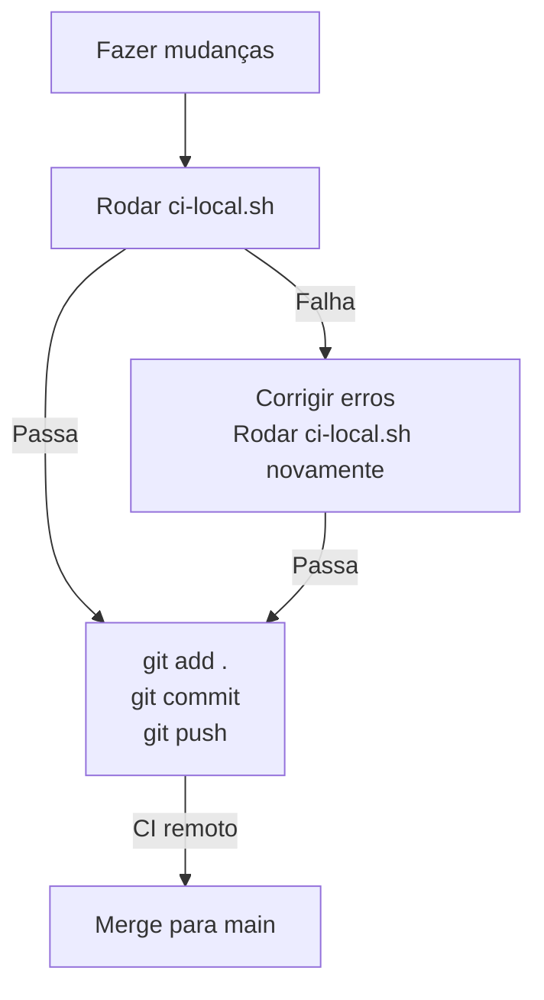

# 🔧 Scripts do Kaven

Ferramentas para desenvolvimento local com **CI escalonado** (progressivo).

---

## 🎯 Novo Modelo: CI Escalonado (RECOMENDADO)

Em vez de um único check pesado, usar **3 níveis** de validação:

```
Commit → Push → PR/Merge
  ↓       ↓       ↓
 Leve   Médio   Pesado
 10s    1-2min  8min
```

### ✨ Benefícios

- **Não trava o dev** durante desenvolvimento
- **Feedback rápido** em cada etapa
- **Checks progressivos** - quanto mais crítico, mais rigoroso
- **Flexibilidade** - pode pular etapas se necessário
- **Economia total** ~50 min/feature vs CI remoto

---

## 🔍 CI Local Checker - 3 Níveis

### Nível 1️⃣ : PRE-COMMIT (Leve - ~10s)

Roda **automaticamente** ao fazer `git commit`.

```bash
# Validações automáticas:
✅ Assinatura GPG (se configurada)
✅ Lint de arquivos staged
✅ Detecção de secrets
```

**Comando manual:**
```bash
./scripts/hooks/pre-commit.sh
```

### Nível 2️⃣ : PRE-PUSH (Médio - ~1-2 min)

Roda **automaticamente** ao fazer `git push`.

```bash
# Validações automáticas:
✅ Linting (completo)
✅ Type checking (TypeScript)
❌ Banco de dados (pulado - muito pesado)
❌ Testes (pulado - pode rodar localmente se quiser)
```

**Comando manual:**
```bash
./scripts/hooks/pre-push.sh
```

### Nível 3️⃣ : PRE-PR (Pesado - ~5-8 min)

Roda **manualmente** ANTES de abrir PR ou fazer merge.

```bash
# Validações completas:
✅ Dependências (pnpm install --frozen-lockfile)
✅ Schema Prisma (merge + generate)
✅ Migrações de banco (docker + db:migrate)
✅ Linting
✅ Type checking
✅ Testes
```

**Comando manual:**
```bash
./scripts/hooks/pre-pr.sh
```

---

## 📋 Instalação Rápida

### Instalação

```bash
# Instalar hooks (pre-commit + pre-push)
./scripts/setup-git-hooks-staged.sh
```

Pronto! Agora:
- `git commit` roda validações leves
- `git push` roda validações médias
- Antes de PR, execute `./scripts/hooks/pre-pr.sh` manualmente

### Workflow Recomendado

```bash
# 1. Desenvolver normalmente
git checkout -b feat/novo-recurso
# ... editar arquivos ...

# 2. Commit (pré-commit hook roda automaticamente)
git add .
git commit -m "feat: novo recurso"
# ✅ Pre-commit checks: assinatura, lint, secrets

# 3. Push (pré-push hook roda automaticamente)
git push origin feat/novo-recurso
# ✅ Pre-push checks: lint completo, typecheck

# 4. ANTES de abrir PR - roda o check pesado
./scripts/hooks/pre-pr.sh
# ✅ Pre-PR checks: tudo + banco de dados + testes

# 5. Abrir PR no GitHub
gh pr create --title "feat: novo recurso" --body "..."
```

### Tempo por Etapa

| Etapa | Tempo | Tipo | Automático? |
|-------|-------|------|------------|
| Commit | ~10s | Leve | ✅ Sim (pre-commit) |
| Push | ~1-2min | Médio | ✅ Sim (pre-push) |
| PR | ~5-8min | Pesado | ⚙️ Manual |
| **Total antes de PR** | **~7-10min** | — | — |
| **VS CI remoto** | **~8-10min** | — | — |

**Nota:** O CI remoto ainda rodará tudo (redundância é OK, garante qualidade).

### Troubleshooting

#### ❌ "Docker daemon não está rodando"

```bash
# Iniciar Docker
open /Applications/Docker.app  # macOS
# ou
sudo systemctl start docker    # Linux

# Depois tentar novamente
./scripts/ci-local.sh
```

#### ❌ "Porta 5432 ocupada"

```bash
# Parar containers
docker compose down

# Iniciar novamente
docker compose up -d
./scripts/ci-local.sh --no-db
```

#### ❌ "pnpm: command not found"

```bash
# Instalar pnpm
npm install -g pnpm

# ou usar npm
npm install
npm run db:generate
```

#### ⏭️ "Pular banco de dados"

```bash
# Útil se banco já está rodando ou você só quer testar linting/types
./scripts/ci-local.sh --no-db
```

---

## ⚙️ Git Hooks Setup (`setup-git-hooks.sh`)

Configura hooks locais para rodar CI automaticamente **antes de cada push**.

### Instalação

```bash
./scripts/setup-git-hooks.sh
```

Isso instala:
- `.git/hooks/pre-push` - Roda `ci-local.sh` antes de fazer push

### Uso

Agora todo `git push` automaticamente roda os checks:

```bash
git push origin feature-branch
# Se falhar → push é cancelado
# Se passar → push continua normalmente
```

### Pular o Hook (Emergências)

Se você REALMENTE precisa fazer push sem os checks:

```bash
git push --no-verify
```

⚠️ **Nota**: Isso é perigoso! Use apenas em emergências.

### Desinstalar

```bash
rm .git/hooks/pre-push
```

---

## 📊 Comparação: Local vs Remoto

| Métrica | Sem CI Local | Com CI Local |
|---------|--------------|--------------|
| **Tempo até feedback** | 5-10 min | 30 seg - 2 min |
| **Iterações para pass** | 5-10 | 1-2 |
| **Tempo total** | 30-60 min | 5-10 min |
| **Pollui histórico?** | ❌ Sim | ✅ Não |
| **Economia** | — | ~50 min |

---

## 🎯 Fluxo de Trabalho Recomendado



### Exemplo Prático

```bash
# 1. Criar branch e fazer mudanças
git checkout -b feat/add-something
# ... editar arquivos ...

# 2. Executar CI localmente
./scripts/ci-local.sh

# Se falhar:
# ❌ Corrigir erros conforme mensagens
# ❌ Rodar ci-local.sh novamente
# ✅ Quando passar, continuar

# 3. Fazer commit
git add .
git commit -m "feat: add something"

# 4. Push (com ou sem pre-push hook)
git push origin feat/add-something

# ✅ CI remoto roda mesmos checks (redundância é OK)
```

---

## 📝 Para Adicionar Novos Checks

Se você adicionar novos checks ao CI remoto, atualize também o `ci-local.sh`:

```bash
# Abra o arquivo
vim scripts/ci-local.sh

# Adicione um novo step:
run_step \
  "🔍 Novo Check" \
  "cd '$PROJECT_ROOT' && pnpm seu-comando" \
  || exit 1

# Teste localmente
./scripts/ci-local.sh
```

---

## 🚀 Próximas Ideias

- [ ] Cache de dependências entre runs
- [ ] Executar apenas checks relevantes (arquivo modified)
- [ ] Integração com IDE (VSCode, JetBrains)
- [ ] Metrics de performance por check
- [ ] Stats de economia de tempo

---

## 📞 Ajuda

```bash
./scripts/ci-local.sh --help
./scripts/setup-git-hooks.sh --help
```

---

*Criado para acelerar desenvolvimento e reduzir tempo de feedback. ⚡*
